# 系统架构与模块图

> 📌 用于 PPT "系统架构" 章节 + 详细方案文档"总体设计"章节
> 🎯 提供 6 类图：系统架构 / 功能模块 / 用户旅程 / 数据流 / Agent 工作流 / ML 训练流程

---

## 一、系统架构图（三层 + 外部服务）

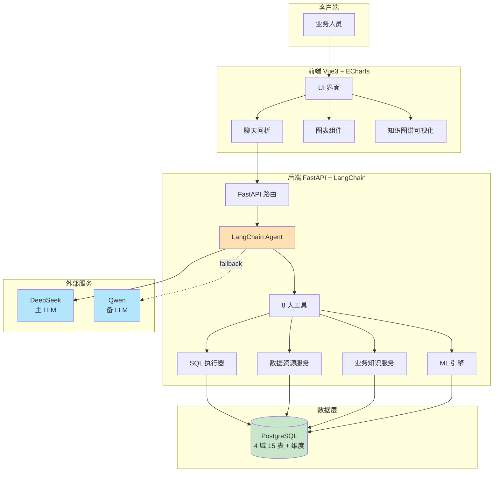

---

## 二、功能模块图（5 大能力 + 1 个平台）

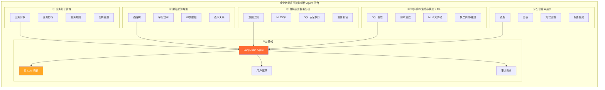

---

## 三、用户旅程图（业务人员视角）

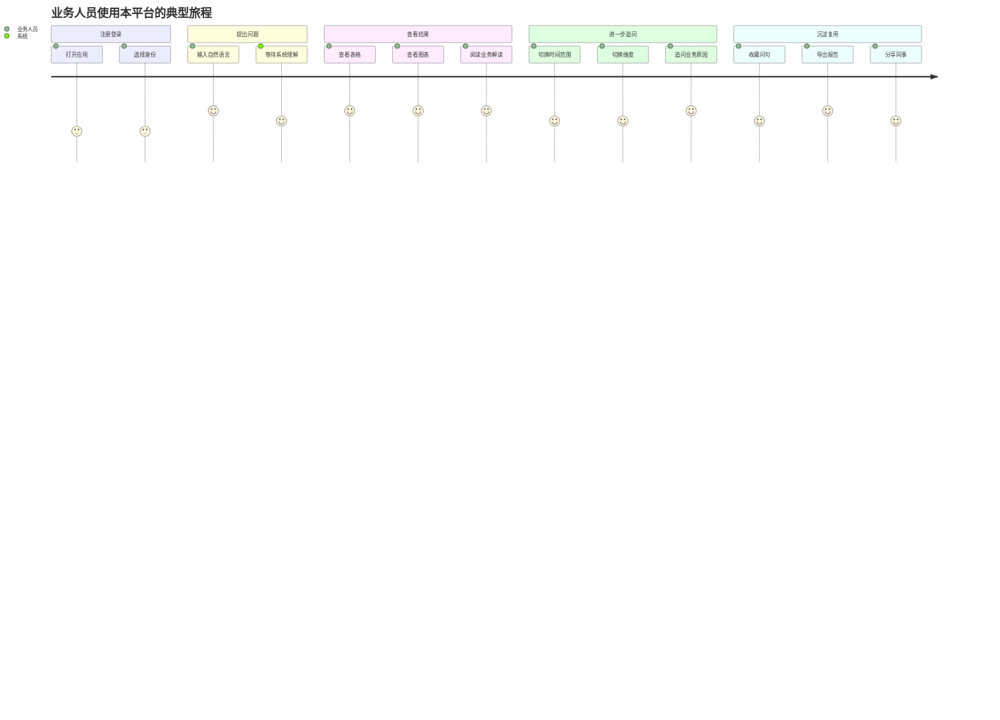

---

## 四、核心业务流程图（用户提问→结果展示）

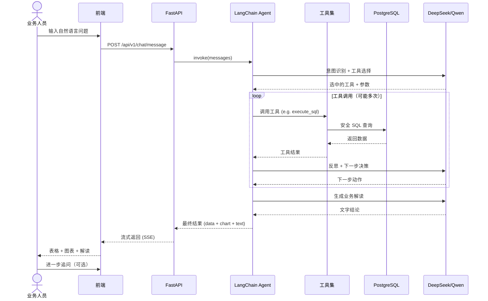

---

## 五、Agent 工作流图（ReAct 范式）

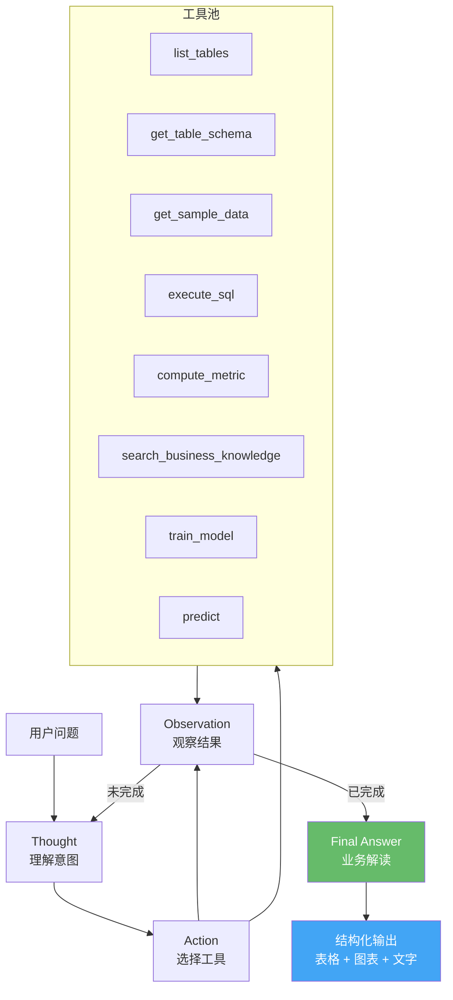

---

## 六、数据流图（端到端）

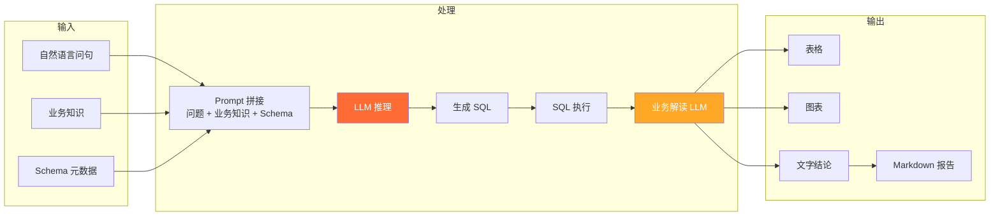

---

## 七、ML 训练流程图

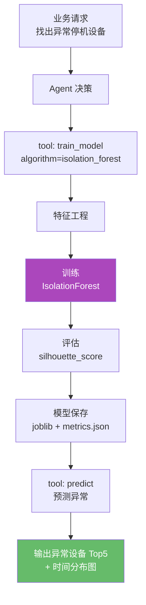

---

## 八、目录结构图（项目骨架）

```
A07-enterprise-data-agent/
├── backend/                        # 后端
│   ├── app/
│   │   ├── main.py                 # FastAPI 入口
│   │   ├── core/                   # 配置/日志/安全
│   │   ├── api/v1/                 # 路由
│   │   │   ├── chat.py
│   │   │   ├── knowledge.py
│   │   │   ├── schema.py
│   │   │   └── analytics.py
│   │   ├── services/               # 业务逻辑
│   │   │   ├── agent.py            # LangChain Agent
│   │   │   ├── sql_executor.py
│   │   │   ├── nl2sql.py
│   │   │   ├── ml_engine.py
│   │   │   └── knowledge.py
│   │   ├── models/                 # SQLAlchemy 模型
│   │   ├── schemas/                # Pydantic
│   │   └── db/                     # 连接/迁移
│   ├── tests/
│   ├── pyproject.toml
│   └── .env.example
├── frontend/                       # 前端
│   ├── src/
│   │   ├── views/
│   │   │   ├── Dashboard.vue       # 主页
│   │   │   ├── Knowledge.vue       # 业务知识
│   │   │   ├── DataSchema.vue      # 数据资源
│   │   │   ├── Chat.vue            # 智能问析
│   │   │   ├── Analytics.vue       # ML 建模
│   │   │   └── KnowledgeGraph.vue  # 知识图谱
│   │   ├── components/
│   │   │   ├── common/
│   │   │   ├── charts/             # ECharts 封装
│   │   │   └── chat/
│   │   ├── stores/                 # Pinia
│   │   ├── api/
│   │   ├── router/
│   │   ├── styles/
│   │   └── constants/
│   ├── public/
│   ├── package.json
│   └── vite.config.ts
├── docs/                           # 文档
│   ├── schedule.md                 # 排期
│   ├── team-roles.md
│   ├── llm-setup.md
│   ├── collaboration/cross-platform.md
│   ├── data-dictionary.md          # 数据字典
│   ├── business-knowledge.md       # 业务知识
│   └── proposal/                   # 比赛材料
│       ├── topic-rationale.md
│       ├── features-highlights.md
│       ├── tech-stack.md
│       └── architecture.md         # 本文件
├── scripts/                        # 跨平台脚本
│   ├── dev.sh
│   ├── dev.ps1
│   └── _common.py
├── .github/workflows/ci.yml        # CI 三平台
├── .env.example
├── .gitattributes
├── .editorconfig
└── README.md
```

---

## 九、模块依赖关系

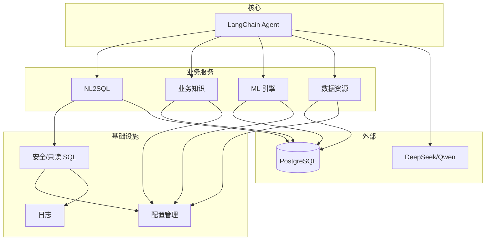

---

## 十、部署架构图（演示环境）

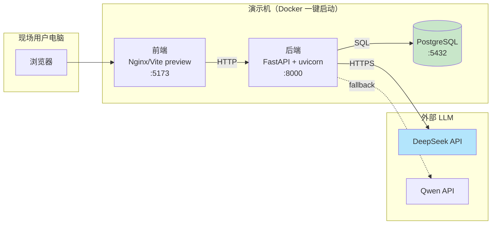

---

## 十一、状态机图（一次问句处理）

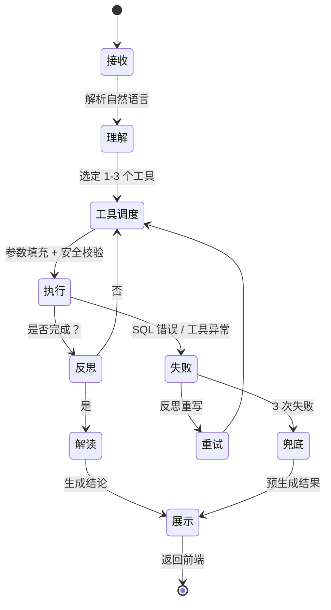

---

## 十二、关键交互时序图（自然语言问数）

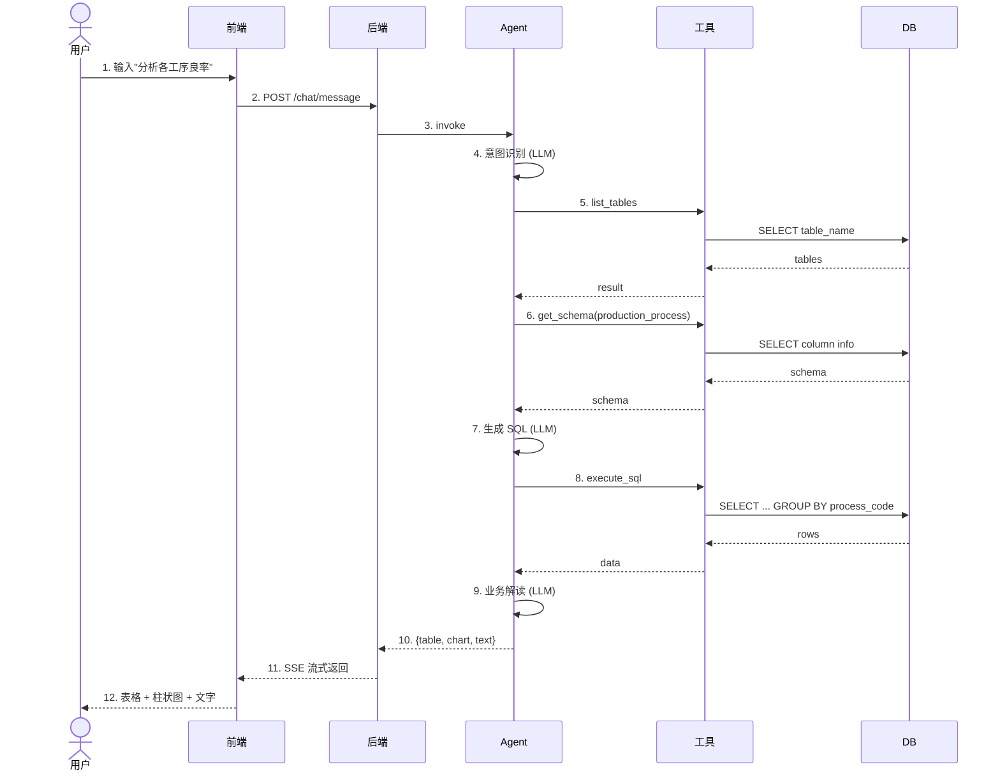

---

## 十三、能力雷达图（比赛要求覆盖度）

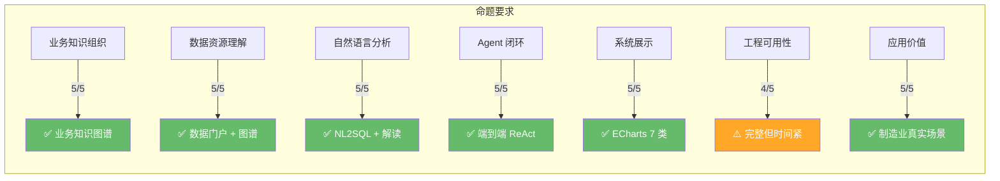

---

## 十四、文件清单

| 类别 | 文件 |
|------|------|
| 业务亮点 | [features-highlights.md](features-highlights.md) |
| 选题原因 | [topic-rationale.md](topic-rationale.md) |
| 技术栈 | [tech-stack.md](tech-stack.md) |
| 跨平台规范 | [../collaboration/cross-platform.md](../collaboration/cross-platform.md) |
| 排期 | [../schedule.md](../schedule.md) |
| 角色 | [../team-roles.md](../team-roles.md) |
| LLM 配置 | [../llm-setup.md](../llm-setup.md) |

---

> **使用建议**：
> - PPT 答辩：**图 1（系统架构）+ 图 3（用户旅程）+ 图 5（Agent 工作流）+ 图 13（雷达图）**
> - 详细方案文档：全部图按章节穿插
> - GitHub README：图 1 + 图 5 + 图 10（部署架构）
